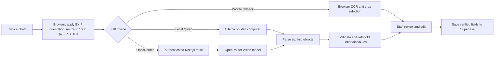

# OCR on the Add page

This guide describes the current invoice reader, the optional OpenRouter path,
and what the three browser tests showed on September 24, 2026. It contains no
invoice photos or customer transcriptions. The test photos live in an ignored
local fixture directory and must not be committed without approval.

## Reader choices

| Choice | Where the photo goes | Role |
| --- | --- | --- |
| Local Qwen through Ollama | The staff computer's `http://localhost:11434` | Default whole-page reader |
| Nemotron through OpenRouter | Next.js server, then OpenRouter and its selected model provider | Optional cloud reader |
| PaddleOCR | Browser only | Manual region and crop fallback |

The Add form has six fields: Client Name, Phone Number, Date Received (`date`),
Date Promised, Instructions / Article Details, and Price. Article text is part
of the existing `instructions` field; there is no separate article database
column. The printed ticket number is not saved as a field.

## OpenRouter setup

1. Copy [`.env.example`](../../.env.example) to `.env.local` at the repository
   root. Set `OPENROUTER_API_KEY` there. `.env.local` is ignored by Git; do not
   use a `NEXT_PUBLIC_` prefix for this key.
2. Leave `OPENROUTER_MODEL` as
   `nvidia/nemotron-3-nano-omni-30b-a3b-reasoning:free`, or set a different
   compatible vision model deliberately. Restart the Next.js server after
   changing environment variables.
3. Run `npm run dev`. Open `/ocr-demo` for a local reader test without Supabase.
   The normal `/add` page requires a Supabase session. For a deployment, set
   the same server-only variables in the deployment environment.
4. Choose a photo on the Add page and click **Read with OpenRouter (cloud)**.
   This sends the resized photo to OpenRouter. Local Qwen remains available,
   and staff can cancel a read or enter values manually.

The free model route can be slow or unavailable. The app keeps the other reader
choices and manual entry available. Never put the OpenRouter key in browser
code or commit `.env.local`.

## Request and review flow

The browser first checks `GET /api/openrouter/read` for configuration and
model name. A read sends a JPEG data URL to `POST /api/openrouter/read`; the
server adds the API key and calls OpenRouter. The route checks same-origin
requests. Outside the local development demo, it requires a signed-in
Supabase user whose profile is not marked deleted. It limits the input size
and bounds the upstream call.
The key is never returned to the browser. The photo is not archived by this
flow; verified field values are saved only when staff submit the form.

The model is asked for each field as `{ value, evidence, confidence }`.
`evidence` should quote the writing and identify its form label or location.
For this Nemotron route, the request relies on a JSON-only prompt; it does
not request OpenRouter's structured-output parameter. The route rejects
malformed or incomplete field objects. Separate model reasoning is ignored.
Model-provided evidence is a review aid, not independent verification.

The prompt covers the two known form layouts, handwriting crossing printed
labels, the store's footer phone, partial customer phone notation, callback
dates, durations in Date Promised, priced instruction lines, and corrected
totals. Staff must still compare every value with the photo.

## What can fill the form automatically

The shared validator in [`app/add/ollama.ts`](../../app/add/ollama.ts) applies
to both the Ollama and OpenRouter model results:

| Field | Current rule |
| --- | --- |
| Client Name | Suggestion only; staff confirm handwriting and spelling. |
| Phone Number | Suggestion only, even when it has 7 or 10 digits. The printed store phone cannot be auto-filled or accepted as a suggestion. A plausible but wrong digit passed format checks in testing. |
| Date Received | Fill only a valid calendar date with matching source evidence; callback notes must not be treated as this field. |
| Date Promised | Fill only a valid calendar date. Durations remain suggestions because the database column is a date. |
| Instructions / Article Details | Suggestion only; staff confirm all lines, prices, and abbreviations. |
| Price | Fill one numeric amount only when the evidence identifies TOTAL CHARGES and quotes the amount. Item prices, deposit, and balance are not totals. |

Low-confidence readings or readings without required evidence stay blank for
review. The form shows suggestions and their evidence beside each input. Staff
can accept, correct, or leave them blank, then must confirm that they checked
the values against the photo before saving. A model failure does not block
manual entry.

## Browser test: three representative invoices

The final validation rules were checked in the real `/ocr-demo` browser flow.
Sample A and B used the older form; Sample C used the Claim Check form. Results
below are intentionally anonymized. “Correct fill” means the value appeared in
the form and agreed with the supplied ground truth; suggestions were not
accepted during this test.

| Field | Sample A | Sample B | Sample C |
| --- | --- | --- | --- |
| Client Name | Wrong suggestion; blank | Correct suggestion; blank | Correct suggestion; blank |
| Phone Number | Correct partial-phone suggestion; blank | Correct partial-phone suggestion; blank | Wrong suggestion; blank after safeguard |
| Date Received | Correct fill | Correctly blank | Correct fill |
| Date Promised | Imprecise duration suggestion; blank | Correctly blank | Correct duration suggestion; blank |
| Instructions / Article Details | Partial/wrong suggestion; blank | Partial/wrong suggestion; blank | Partial/wrong suggestion; blank |
| Price | Correct fill | Correct corrected-total fill | Correct fill |

| Sample | Final call time | Correct auto-fills | Wrong auto-fills |
| --- | ---: | ---: | ---: |
| A | 37.0 seconds | 2 | 0 |
| B | 235.2 seconds | 1 | 0 |
| C, after phone safeguard | 36.7 seconds | 2 | 0 |

Total: **5 correct and 0 wrong auto-filled values across 18 fields**. The
first Sample C run did incorrectly auto-fill a plausible but wrong customer
phone. We changed phones to suggestion-only and reran that invoice; the wrong
number then remained visible for review while the form field stayed blank.
The model repeated other handwriting mistakes in names and instructions, so
those fields also remain suggestion-only. The 235.2-second call shows that
latency on the free route can vary substantially. Three samples are a smoke
test, not an accuracy estimate for the archive.

## Relevant files

- [`app/add/photo-reader.tsx`](../../app/add/photo-reader.tsx): reader buttons,
  progress, cancellation, and photo review UI.
- [`app/add/openrouter.ts`](../../app/add/openrouter.ts): browser health check,
  image upload, and response parsing.
- [`app/api/openrouter/read/route.ts`](../../app/api/openrouter/read/route.ts):
  server-only key use, auth, same-origin check, and OpenRouter request.
- [`app/add/ollama.ts`](../../app/add/ollama.ts): shared prompt, image preparation,
  field parsing, and validation; also the local Ollama reader.
- [`app/add/add-form.tsx`](../../app/add/add-form.tsx): suggestions, accepted
  values, and the save confirmation.
- [`app/add/paddle.ts`](../../app/add/paddle.ts) and
  [`app/add/field-mapper.ts`](../../app/add/field-mapper.ts): retained browser
  OCR fallback.
