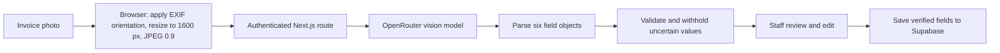

# OCR on the Add page

This guide describes the invoice reader powered by OpenRouter. It contains no
invoice photos or customer transcriptions. The test photos live in an ignored
local fixture directory and must not be committed without approval.

## Reader overview

The application uses an AI vision model via OpenRouter to read photographed
handwritten invoices. The browser downsizes and prepares the image, and sends it
through a secure server route to OpenRouter.

The Add form has six fields: Client Name, Phone Number, Date Received (`date`),
Date Promised, Instructions / Article Details, and Price. Article text is part
of the existing `instructions` field; there is no separate article database
column. The printed ticket number is not saved as a field.

## OpenRouter setup

1. Copy [`.env.example`](../../.env.example) to `.env.local` at the repository
   root. Set `OPENROUTER_API_KEY` there. `.env.local` is ignored by Git; do not
   use a `NEXT_PUBLIC_` prefix for this key.
2. Set `OPENROUTER_MODEL` (e.g. `google/gemma-4-31b-it:free` or `nvidia/nemotron-3-nano-omni-30b-a3b-reasoning:free`). Restart the Next.js server after
   changing environment variables.
3. Run `npm run dev`. Open `/ocr-demo` for a local reader test without Supabase.
   The normal `/add` page requires a Supabase session. For a deployment, set
   the same server-only variables in the deployment environment.
4. Choose a photo on the Add page and click **Read invoice with AI**.
   This sends the resized photo to OpenRouter. Staff can cancel a read or enter
   values manually.

## Request and review flow

```mermaid
flowchart LR
    Photo[Invoice photo] --> Prep[Browser: apply EXIF orientation, resize to 1600 px, JPEG 0.9]
    Prep --> Route[Authenticated Next.js route]
    Route --> Provider[OpenRouter vision model]
    Provider --> Parse[Parse six field objects]
    Parse --> Validate[Validate and withhold uncertain values]
    Validate --> Review[Staff review and edit]
    Review --> Save[Save verified fields to Supabase]
```

The browser first checks `GET /api/openrouter/read` for configuration and
model name. A read sends a JPEG data URL to `POST /api/openrouter/read`; the
server adds the API key and calls OpenRouter. The route checks same-origin
requests. Outside the local development demo, it requires a signed-in
Supabase user whose profile is not marked deleted. It limits the input size
and bounds the upstream call.
The key is never returned to the browser. The photo is not archived by this
flow; verified field values are saved only when staff submit the form.

The model is asked for each field as `{ value, evidence, confidence }`.
`evidence` should quote the writing and identify its form label or location.
The route rejects malformed or incomplete field objects. Separate model reasoning
is ignored. Model-provided evidence is a review aid, not independent verification.

The prompt covers the two known form layouts, handwriting crossing printed
labels, the store's footer phone, partial customer phone notation, callback
dates, durations in Date Promised, priced instruction lines, and corrected
totals. Staff must still compare every value with the photo.

## What can fill the form automatically

The shared validator in [`app/add/reader.ts`](../../app/add/reader.ts) applies
to model results:

| Field | Current rule |
| --- | --- |
| Client Name | Suggestion only; staff confirm handwriting and spelling. |
| Phone Number | Suggestion only, even when it has 7 or 10 digits. The printed store phone cannot be auto-filled or accepted as a suggestion. A plausible but wrong digit passed format checks in testing. |
| Date Received | Fill only a valid calendar date with matching source evidence; callback notes must not be treated as this field. |
| Date Promised | Fill only a valid calendar date. Durations remain suggestions because the database column is a date. |
| Instructions / Article Details | Suggestion only; staff confirm all lines, prices, and abbreviations. |
| Price | Fill one numeric amount only when the evidence identifies TOTAL CHARGES and quotes the amount. Item prices, deposit, and balance are not totals. |

Low-confidence readings or readings without required evidence stay blank for
review. The form shows suggestions and their evidence beside each input. Staff
can accept, correct, or leave them blank, then must confirm that they checked
the values against the photo before saving. A model failure does not block
manual entry.

## Relevant files

- [`app/add/photo-reader.tsx`](../../app/add/photo-reader.tsx): reader UI, progress,
  cancellation, and photo review.
- [`app/add/openrouter.ts`](../../app/add/openrouter.ts): browser health check,
  image upload, and response handling.
- [`app/api/openrouter/read/route.ts`](../../app/api/openrouter/read/route.ts):
  server-only key use, auth, same-origin check, and OpenRouter request.
- [`app/add/reader.ts`](../../app/add/reader.ts): shared prompt, image preparation,
  field parsing, and validation.
- [`app/add/add-form.tsx`](../../app/add/add-form.tsx): suggestions, accepted
  values, and the save confirmation.
