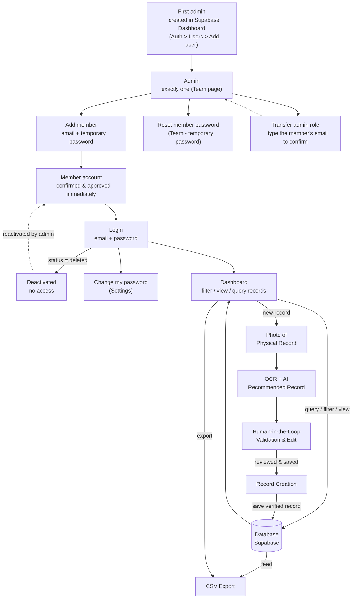

# Workflow Diagram

## Flow summary

1. **Accounts are admin-managed** - no self-signup, no email flows. The very
   first admin must be created once in the Supabase Dashboard (Authentication
   > Users > Add user); the `handle_new_user` trigger auto-creates their
   profile row as `approved`.
2. **Add a member (Team)** - the admin creates an account from the Team page
   with an email and a temporary password. The account is confirmed and
   approved immediately.
3. **Login** - only approved accounts sign in (email + password). A
   deactivated account (`status = deleted`) is blocked at login.
4. **Change password** - every member changes their own password in Settings;
   no recovery email is involved. If a member forgets their password, the
   admin sets a new temporary password from the Team page and shares it out of
   band.
5. **Single admin** - there is exactly one admin (enforced by a partial unique
   index on `profiles.is_admin`). The admin can transfer the role to another
   active member from the Team page; transferring requires typing that
   member's email exactly as confirmation. The sole admin cannot deactivate
   their own account without transferring first.
6. **Dashboard** - after login, the main screen offers three paths:
   - **View path**: query, filter, and view existing records straight from the database.
   - **Export path**: download the (filtered) records as a CSV file from the database.
   - **Create path**: walk the digitization workflow for a new record.
7. **Photo of physical record** - staff capture the paper invoice.
8. **OCR + AI recommended record** - Transformers.js reads the image and
   suggests values for the six fields (Client Name, Phone Number, Date, Date
   Promised, Instructions/Article Details, Price).
9. **Human-in-the-loop validation** - staff review and correct the suggested
   fields. Records have no database `status` column; drafts and OCR state
   exist only in the browser until a verified record is saved.
10. **Record creation** - the verified record is saved and becomes viewable,
    queryable, and exportable back on the dashboard.

### Team roles

| Role | What they can do |
| ---- | ---------------- |
| Admin (exactly 1) | Everything members can, plus add members, deactivate/reactivate members, reset member passwords, transfer the admin role. The `Team` nav item is only visible to the admin. |
| Member | View/filter/export records, create and validate new records, change their own password (Settings), deactivate their own account (Settings). |