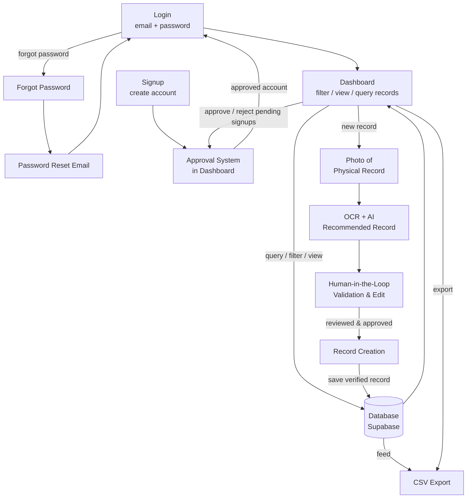

# Workflow Diagram

## Flow summary

1. **Login / Signup** - access is gated behind individual email/password accounts (no shared password).
   - **Signup**: a new account is created and goes into a **pending** state until an existing authenticated user approves it.
   - **Login**: only approved accounts can sign in.
2. **Password reset** - from Login, a user can request a password reset, receives a recovery email, sets a new password, and returns to Login.
3. **Approval system** - the Dashboard includes an approval queue showing pending signups; existing authenticated users approve or reject them, which activates or denies the account.
4. **Dashboard** - after login, the main screen offers three paths:
   - **View path**: query, filter, and view existing records straight from the database.
   - **Export path**: download the (filtered) records as a CSV file from the database.
   - **Create path**: walk the digitization workflow for a new record.
5. **Photo of physical record** - staff capture the paper invoice.
6. **OCR + AI recommended record** - Transformers.js reads the image and suggests values for the six fields (Client Name, Phone Number, Date, Date Promised, Instructions/Article Details, Price).
7. **Human-in-the-loop validation** - staff review and correct the suggested fields.
8. **Record creation** - the verified record is saved.
9. **Database** - approved records are stored in Supabase and become viewable/queryable back on the dashboard, and exportable to CSV.