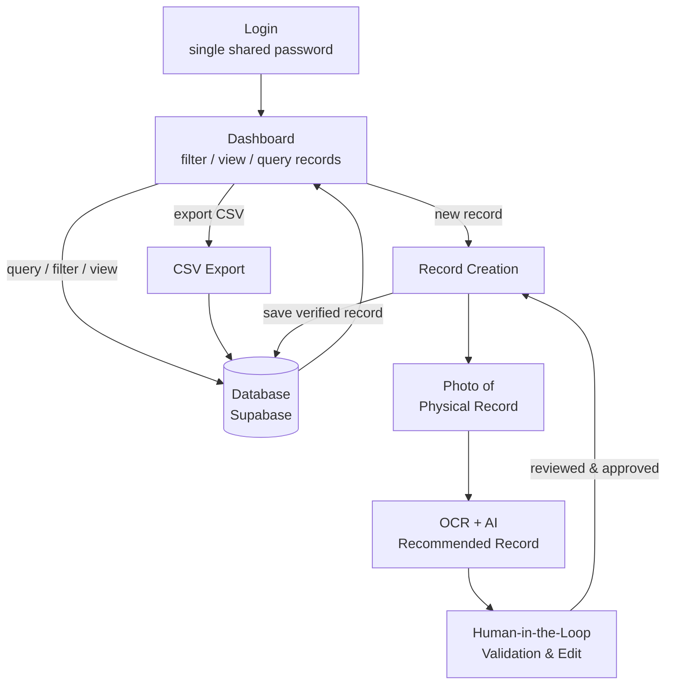

# Workflow Diagram

## Flow summary

1. **Login** - the app is gated behind a single shared password (no accounts).
2. **Dashboard** - the main screen offers three paths:
   - **View path**: query, filter, and view existing records straight from the database.
   - **Export path**: download the (filtered) records as a CSV file from the database.
   - **Create path**: walk the digitization workflow for a new record.
3. **Photo of physical record** - staff capture the paper invoice.
4. **OCR + AI recommended record** - Transformers.js reads the image and suggests values for the six fields (Client Name, Phone Number, Date, Date Promised, Instructions/Article Details, Price).
5. **Human-in-the-loop validation** - staff review and correct the suggested fields.
6. **Record creation** - the verified record is saved.
7. **Database** - approved records are stored in Supabase and become viewable/queryable back on the dashboard, and exportable to CSV.